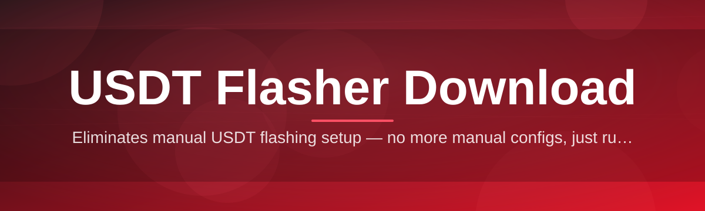
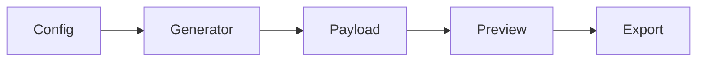

# usdt-flasher-utility 🧾⚡

  

*A no-fuss Windows utility for simulating, testing, and previewing USDT flash transactions before anything touches a real chain.*

  

---

## 🧠 Overview

`usdt-flasher-utility` is a desktop tool built for one job: giving developers, QA testers, and blockchain educators a safe, sandboxed way to generate simulated USDT flash transactions for testing wallets, block explorers UI, and integration pipelines. This is **not** a tool that moves real value on any live network — it's a controlled testbed that mimics transaction payloads, confirmation states, and explorer-style outputs so you can validate how your software reacts before you go anywhere near mainnet.

The project exists because the space around "USDT flasher download" tools is a mess of shady, undocumented binaries with zero transparency. This repo flips that — it's fully open, versioned, and built by a solo dev who got tired of watching people download sketchy `.exe` files with no changelog and no idea what's running under the hood. Every release here is traceable, every behavior is documented, and the utility never claims to do something it can't.

Who's this for? QA engineers testing wallet UIs against pending/confirmed transaction states, educators demonstrating how TRC20/ERC20 USDT transfers are structured, and developers building explorer integrations who need repeatable, deterministic test data instead of flaky testnet faucets. If that's you, keep reading.

> [!NOTE]
> This tool generates simulated transaction data for local testing and UI/UX validation. It does not create, mint, or transfer real USDT on any blockchain network.

  

---

## 🚫 What This Is NOT

Before you get any ideas — let's be blunt about scope, because the "USDT flasher" space is full of noise.

| ❌ It is NOT | ✅ It IS |
|---|---|
| A tool to create real, spendable USDT | A simulation/testing utility for transaction payloads |
| A way to double-spend or forge on-chain balances | A local sandbox for wallet & explorer QA |
| A "money glitch" or exploit of any exchange | A transparent, MIT-licensed dev tool |
| Something that touches mainnet funds | Fully offline-capable, no live broadcast |

> [!IMPORTANT]
> There is no version of this software, past or future, that mints real cryptocurrency. If a listing anywhere claims otherwise, it is not this project.

---

## 🔥 Capabilities That Actually Matter

- **Simulated Flash Generator** — builds realistic TRC20/ERC20-style USDT transaction objects with configurable amount, hash format, and timestamp so your test suite has believable fixtures.

- **Explorer-Style Preview** — renders a mock block-explorer view of the generated transaction, complete with confirmation counters, so you can screenshot or demo flows without a live network.

- **Multi-Network Templates** — presets for Tron, Ethereum, and BSC-flavored payload structures, since USDT behaves differently depending on the chain it's dressed up as.

- **Session Logging** — every generated flash gets logged locally with a timestamp and config snapshot, so you can reproduce a test case months later without guessing.

- **Batch Mode** — queue up dozens of simulated transactions in one pass for stress-testing dashboards or notification systems that expect high transaction volume.

- **Offline-First Design** — the whole utility runs without an internet connection. No hidden telemetry pinging out, no background network calls you didn't ask for.

- **One-Click Export** — dump generated transaction sets to JSON or CSV for feeding directly into your own test harnesses or CI pipelines.

- **Portable Build** — a single standalone `.exe`. No installer wizard, no registry sprawl, no leftover services running after you close it.

> [!TIP]
> Use Batch Mode + JSON export together to build a repeatable fixture library for your wallet's automated test suite — way faster than hand-writing mock transactions.

---

## 🚀 How To Get Started

1. **Visit the landing page** using the download button above or below — that's the only place this project distributes builds from.

2. **Download the latest build** for Windows 10/11 (x64). No account, no email gate, no subscription.

3. **Run the executable** — Windows SmartScreen may flag it as unrecognized since it's an indie-signed binary; click "More info → Run anyway."

4. **Pick a network template**, set your parameters, and hit generate. Your simulated USDT flash output appears instantly in the preview pane.

---

## 🖥️ System Requirements

| Requirement | Detail |
|---|---|
| **OS** | Windows 10 (64-bit) or Windows 11 |
| **RAM** | 2 GB minimum, 4 GB recommended |
| **Disk** | ~85 MB free space |
| **Dependencies** | None — fully standalone binary |
| **Network** | Optional — only needed for landing-page download and update checks |
| **.NET / Runtime** | Bundled internally, nothing to install separately |

  

---

## ⚙️ How It Works

The internal flow is intentionally simple — no hidden services, no background daemons.

1. **You configure parameters** — network type, amount, and confirmation depth in the UI.

2. **The generator engine builds a payload** matching that network's transaction structure (hash format, decimals, gas-style metadata).

3. **The preview renderer** formats that payload into an explorer-style card so it *looks* like a real chain confirmation, purely for visual/testing purposes.

4. **Optional export** writes the result to disk as JSON/CSV for your own automated pipelines.

5. **Session log updates** locally so nothing generated during a session is ever lost if the app closes unexpectedly.

> [!WARNING]
> Exported payloads are formatted to *look* like real transaction data for UI-testing purposes. They contain no valid signatures and will be rejected by any real node or wallet if broadcast — because they aren't broadcastable to begin with.

---

## 🛟 Troubleshooting

<strong>Windows SmartScreen is blocking the download / launch</strong>

 

This happens with indie-signed executables that haven't built up Microsoft reputation yet. Click "More info," then "Run anyway." The binary is unmodified from what's published on the landing page.

<strong>The generated transaction doesn't show up on a real block explorer</strong>

 

Correct — that's expected behavior, not a bug. This tool never broadcasts to any live network. Explorer-style previews are rendered locally inside the app only.

<strong>Batch Mode is generating slower than expected</strong>

 

Large batches (500+) with the Explorer Preview enabled simultaneously will slow rendering. Disable live preview during batch runs and export straight to JSON for best throughput.

<strong>My antivirus quarantined the executable</strong>

 

Some heuristic AV engines flag unsigned/lightly-signed portable `.exe` files by default. Whitelist the file after downloading it only from the official landing page linked in this README.

<strong>Can I use this to test on a real testnet like Sepolia or Nile?</strong>

 

Not directly — this tool is offline-simulation only and doesn't broadcast to testnets or mainnets. It's meant to feed your own test harness with realistic mock data, not to interact with live infrastructure.

<strong>Where do I report a bug?</strong>

 

Open an issue in this repository with your OS build, steps to reproduce, and (if relevant) the exported JSON that triggered the problem.

---

## 🎛️ UI / UX Details

> [!TIP]
> Dark mode is the default theme — because nobody wants to test transactions at 2am with a blinding white UI.

**Keyboard shortcuts:**

| Shortcut | Action |
|---|---|
| `Ctrl + G` | Generate new simulated transaction |
| `Ctrl + B` | Toggle Batch Mode |
| `Ctrl + E` | Export current session |
| `Ctrl + L` | Open session log viewer |
| `Ctrl + ,` | Open Settings panel |
| `F5` | Refresh preview pane |

**Themes:** Dark (default), Light, and a High-Contrast mode for accessibility.

**Settings panel highlights:**

- Default network template (Tron / Ethereum / BSC)
- Decimal precision override
- Auto-export on generate (on/off)
- Session log retention window
- Confirmation counter animation speed

---

## 🤝 Contributing & Community

This started as a solo project, but it doesn't have to stay that way.

- **Open an issue** for bugs, unexpected UI behavior, or feature requests.
- **Submit a PR** — small, focused changes get reviewed fastest. Explain the *why*, not just the *what*.
- **Discuss ideas** in the Discussions tab before building anything large — saves everyone rework.

> [!NOTE]
> There is no CLA and no corporate backing here — just a dev who ships fast and reviews PRs when they land. Be patient, be specific, and tests help your case.

---

## 📄 License

Released under the [MIT License](LICENSE), 2026. Use it, fork it, build on it — just don't slap a real-money claim on top of it.

---

## ⚠️ Disclaimer

`usdt-flasher-utility` is a simulation and testing tool only. It does not create, mint, transfer, or broadcast real cryptocurrency on any blockchain network, and it cannot be used to generate spendable funds of any kind. Any resemblance between generated payloads and real transaction data is purely for UI/UX and QA testing purposes. The author assumes no liability for misuse, and by downloading this tool you acknowledge it is provided "as is," without warranty, strictly for development, education, and testing contexts.

---

  

